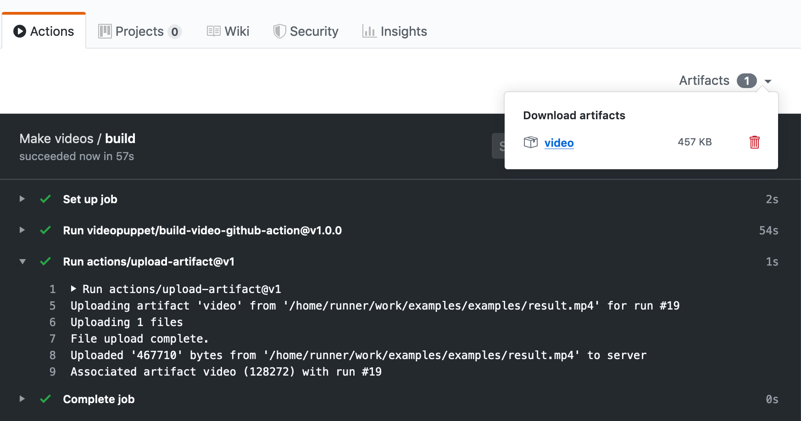

# Video Puppet GitHub Action 

GitHub Action to build videos from files in GitHub repositories using [Video Puppet](https://www.videopuppet.com). 

Video Puppet allows you to compose videos from source files and assets, and edit videos as easy as editing plain text. It makes it easy to version control videos, include video building into continuous integration and generate video with multiple formats and languages from the same assets. Check out some nice [examples](https://github.com/videopuppet/examples).

## Inputs

### `github-token`

**Required** The GitHub action Authentication Token to access the repository. Use `${{ secrets.GITHUB_TOKEN }}` to automatically set it to the token generated for the action

### `videopuppet-api-key`
   
**Required** Video Puppet API Key for your account. To obtain a key, write to <contact@videopuppet.com>. 

**Do not store the token directly in the action**. Instead, store it as an [encrypted secret](https://help.github.com/en/actions/automating-your-workflow-with-github-actions/creating-and-using-encrypted-secrets) to your repository, and then reference as `${{ secrets.SECRET_NAME }}`.

### `source-path`

**Required** Relative path to the main video source file (.yaml or .json); for example `hello-world/script/source.yml`. Do not include the starting slash.

### `result-file`

**Optional** Local file system path for the result file; if you do not set this, the action will use the file name generated by Video Puppet. You will be able to read out the resulting file in any case from the action outputs.

### `api-url`

**Optional** override for the API URL, used only for developers when testing; ignore this parameter unless you are developing this action.

## Outputs

### `video-file`

Resulting video file, ready for uploading to GitHub action artifacts or further processing.

### `video-url`

Temporary secure (signed) video URL - valid for 10 minutes - which can be used to download the video directly from Video Puppet. 

## Example usage

The following workflow will generate a video using this action, then upload it to the [workflow artifacts](https://help.github.com/en/actions/automating-your-workflow-with-github-actions/persisting-workflow-data-using-artifacts).

```
name: Make videos
on: [push]
jobs:
  build:
    runs-on: ubuntu-latest
    steps:
    - uses: videopuppet/build-video-github-action@v1.0.0
      id: video
      with:
        source-path: hello-world/script/source.yml
        github-token: ${{ secrets.GITHUB_TOKEN }}
        videopuppet-api-key: ${{ secrets.VIDEOPUPPET_API_KEY }}
    - uses: actions/upload-artifact@v1
      with:
        name: video
        path: "${{ steps.video.outputs.video-file }}"
```

You will be able to access the generated video from the `Artifacts` menu in your GitHub Workflow



## For developers and contributors

See [CONTRIBUTING.md](CONTRIBUTING.md).
